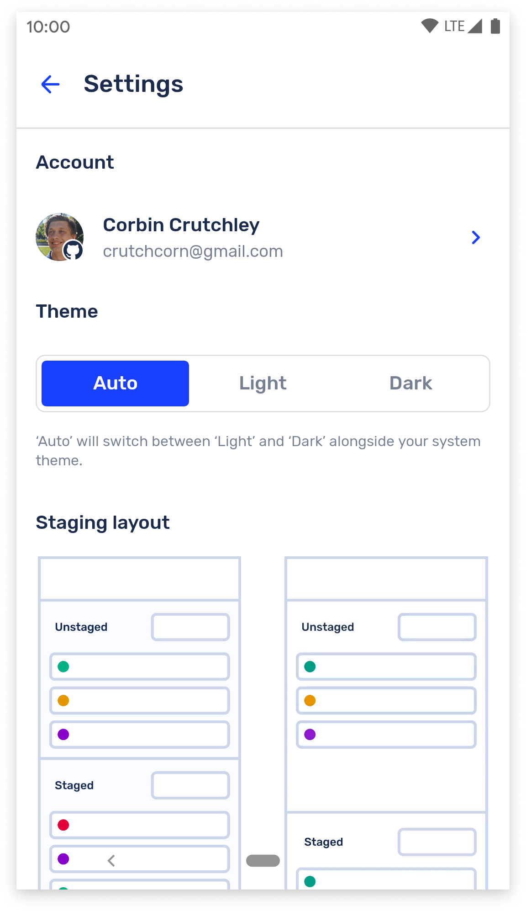

    

<h1 align="center">
  GitShark
</h1>

GitShark is a Git GUI in a similar vein to [Git Fork](https://git-fork.com/), [GitKraken](https://www.gitkraken.com/), and others. The big difference? It runs on mobile!

We're currently targeting Android as the initial launch platform, but have long-term goals to port this to iOS as well as desktop OSes such as Windows and MacOS. We're able to do this because we're building on top of React Native, which allows us to more easily port our code.

> **This app is still under active development. We are currently running a closed alpha for Android.** In the near future, we hope to run a closed alpha for iOS as well.

# Screenshots

While design is an ever-changing goal post and the current design is subject to change prior to release, these are screenshots from the currently running alpha:

We also have a wide variety of animations thrown throughout the application to make the experience more pleasant.