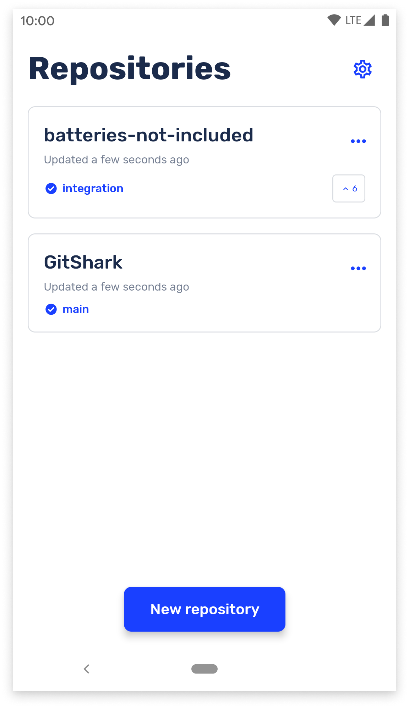
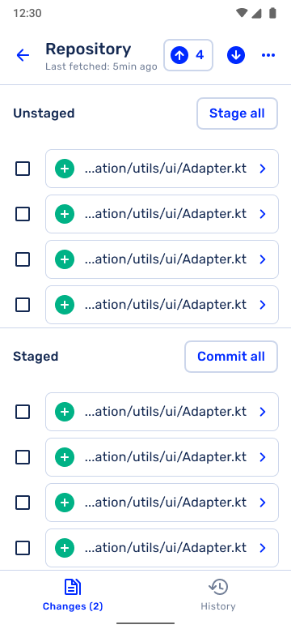
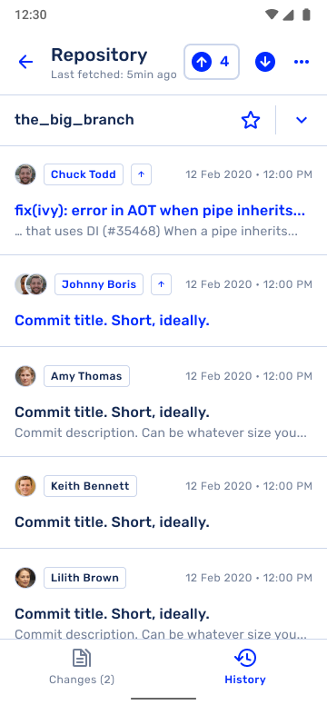

    

<h1 align="center">
  GitShark
</h1>

GitShark is a Git GUI in a similar vein to [Git Fork](https://git-fork.com/), [GitKraken](https://www.gitkraken.com/), and others. The big difference? It runs on mobile!

We're currently targeting Android as the initial launch platform, but have long-term goals to port this to iOS as well as desktop OSes such as Windows and MacOS. We're able to do this because we're building on top of React Native, which allows us to more easily port our code.

> THIS APP IS STILL UNDER ACTIVE DEVELOPMENT. WE ARE CURRENTLY IN A PRE-ALPHA STATE.
>
> While we welcome feature requests in our issues, we request politely that bugs are not reported on GH issues until such time that we've cut an alpha release

# Design

While we're not fully finished with implementing the mockups provided to us, this is what the app should look like when finished:

| Name of Screen      | Screenshot                                                   |
| ------------------- | ------------------------------------------------------------ |
| Repo List           |  |
| Changes List        |     |
| Commit Page         |         |
| Commit History Page |       |

Additionally, we're making great strides to ensure that the UI is polished with animations where appropriate.
